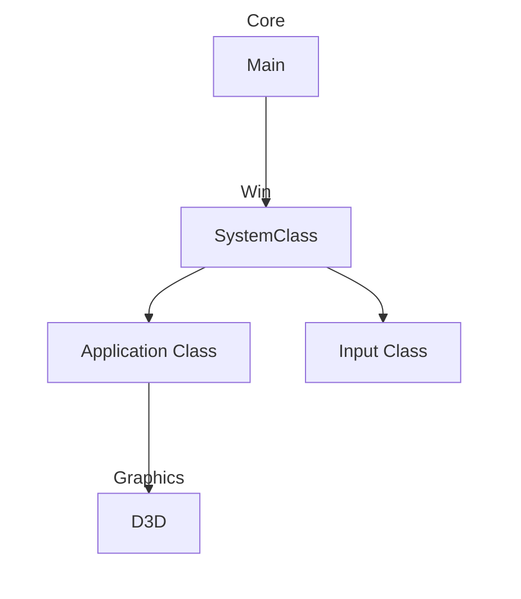

```mermaid
%%{init: { 'themeVariables': { 'clusterBkg': 'transparent', 'clusterBorder': 'transparent'}}}%%
flowchart TB
subgraph Core
CoreMain["Main"]
end
CoreMain --> WinSystem
subgraph Win
	WinSystem["SystemClass"]
	WinSystem --> WinApplication["Application Class"]
	WinSystem --> WinInput["Input Class"]
end
WinApplication --> GraphicsD3D
subgraph Graphics
	GraphicsD3D["D3D"]
end
```
