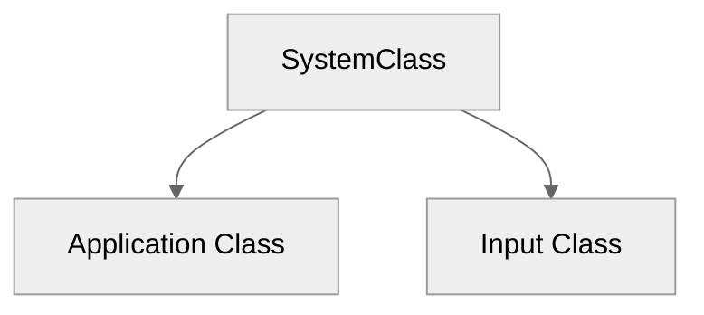

# `src\Win\`

## `System`
The SystemClass encapsulates the entire application lifecycle. It is instantiated and run from the wWinMain function.

Its meant to:
- Managing the main window and message loop
- Handling user input via the @InputClass
- Managing the graphics subsystem via the @ApplicationClass
- Coordinating initialization, per-frame updates, and shutdown of all subsystems

### `Includes`
In its functionalities, the SystemClass defines the Window itself and what runs within it.
```cpp
#include <Windows.h> //  The fundamental of development in WinAPI
#include <dwmapi.h>  //  Header used for Desktop Window Manager (DWM).
#pragma comment(lib, "dwmapi.lib")   //  Static link which provides access to the DWM API.

#include "inputclass.h"  //  Header from keyboard handler class.
#include "applicationclass.h"  //  Header from Application cycle class.
```
### `Definitions`
```cpp
class SystemClass
{
public:
	SystemClass();
	SystemClass(const SystemClass&);
	~SystemClass();

	bool Initialize();
	void Shutdown();
	void Run();

	LRESULT CALLBACK MessageHandler(HWND, UINT, WPARAM, LPARAM);

private:
	bool Frame();
	void InitializeWindows(int&, int&);
	void ShutdownWindows();
	LPCWSTR m_applicationName;
	HINSTANCE m_hinstance;
	HWND m_hwnd;

	InputClass* m_input;
	ApplicationClass* m_application;
};

static LRESULT CALLBACK WndProc(HWND, UINT, WPARAM, LPARAM);
static SystemClass* ApplicationHandle = 0;
```
